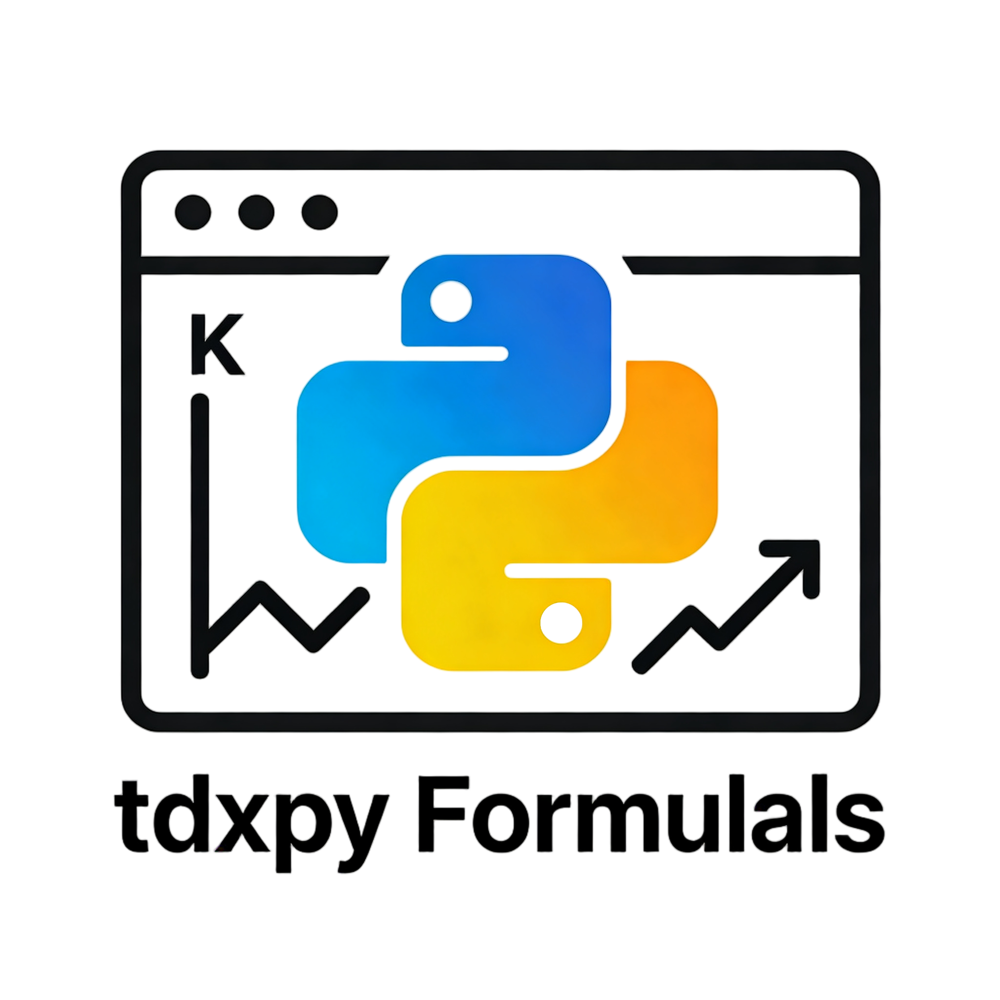
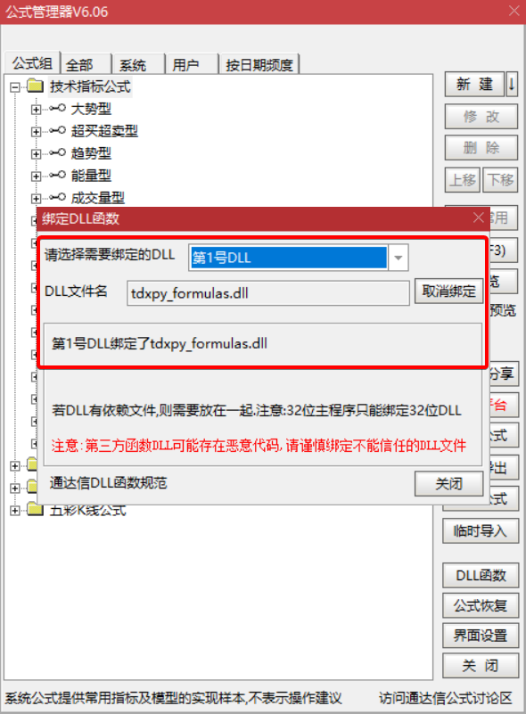

<div align="center">
  </img>
<p><strong>tdxpy_formulas</strong>：通达信Python公式插件框架</p>
</div>

[](https://opensource.org/licenses/MIT)
[](https://www.python.org/)
[](https://www.microsoft.com/windows)
[]()

## 项目简介

**tdxpy_formulas** 是一个为通达信软件开发的Python公式插件框架，允许开发者使用Python编写自定义技术指标和公式，并在通达信软件中直接调用。通过本框架，使用者可以将Python的强大数据分析能力与通达信的实时行情系统进行结合。

### 核心特性

- **嵌入Python**：内置Python 3.14.2 32位运行环境，无需单独安装
- **集成到通达信** - 符合通达信DLL插件规范，即插即用
- **JSON配置管理** - 使用jsoncpp库管理所有Python公式配置
- **平衡性能与效率** - C++与Python混合编程，充分发挥两者优势
- **简易日志系统** - 多级别日志记录，便于调试和监控
- **易于扩展**：模块化设计，便于添加新的Python公式模块
- **热重载支持** - 支持Python模块热重载，开发调试更便捷
- **开源免费**：基于MIT协议，完全开源，可自由修改和分发

## 技术栈

| 组件 | 版本/要求 | 说明 |
|------|-----------|------|
| **开发工具** | Visual Studio 2022 (64位) | 推荐使用VS 2022 Community/Professional |
| **构建系统** | CMake 3.20+ | 跨平台构建支持 |
| **Python** | 3.14.2 (32位) | 项目已内置，无需单独安装 |
| **C++标准** | C++17 | 使用现代C++特性 |
| **JSON解析** | jsoncpp 1.9.5+ | 高性能JSON解析库 |
| **操作系统** | Windows 10/11 | 支持64位系统运行32位插件 |
| **通达信版本** | 7.0+ | 兼容主流通达信版本 |

## 📁 项目结构

```
tdxpy_formulas/
├── CMakeLists.txt                # 主CMake配置文件
├── src/                          # C++源代码
│   ├── dll_main.cpp              # DLL主入口
│   ├── tdxpy_config_manager.cpp  # 配置管理器
│   ├── tdxpy_logger.cpp          # 日志系统
│   ├── tdxpy_plugin_registry.cpp # 插件注册
│   └── tdxpy_python_engine.cpp   # Python引擎
├── include/                      # C++头文件
├── python/                       # Python代码
│   └── tdxpy_formulas/           # Python公式脚本
├── config/                       # 配置文件
├── third_party/                  # 第三方依赖
│   ├── json/                     # jsoncpp库
│   └── Python3142-32/            # Python 3.14.2 32位
├── tests/                        # 测试代码
├── docs/                         # 文档
└── scripts/                      # 构建和部署脚本
```

## 快速开始

### 前置要求

- **通达信软件**：版本 ≥ 7.0
- **Python 3.14.2**：32位版本（已包含在项目中）
- **Visual Studio 2022** 或 **CMake 3.15+**
- **Windows 7/10/11**（32位或64位系统）

### 第一步：环境准备

#### 1.1 安装开发工具

1. **Visual Studio 2022** (已安装略过)
   - 下载地址: [Visual Studio 2022](https://visualstudio.microsoft.com/downloads/)
   - 安装时选择 "使用C++的桌面开发" 工作负载
   - 确保包含以下组件:
     - MSVC v143 - VS 2022 C++ x64/x86 生成工具
     - Windows 10 SDK (10.0.20348.0+)
     - C++ CMake 工具

2. **CMake 3.20+** (已安装略过)
   - 下载地址: [CMake Downloads](https://cmake.org/download/)
   - 选择Windows x64安装包
   - 安装时勾选 "Add CMake to the system PATH"

3. **Git** (已安装略过)
   - 下载地址: [Git for Windows](https://gitforwindows.org/)

#### 1.2 克隆项目

```bash
# 克隆项目仓库
git clone https://gitee.com/icodewr/tdxpy_formulas
cd tdxpy_formulas

# 如果使用子模块（可选）
git submodule update --init --recursive
```

### 第二步：构建项目

#### 方法1：使用命令行

```bash
# 创建构建目录
mkdir build
cd build

# 配置CMake (32位 Release)
cmake .. -G "Visual Studio 17 2022" -A Win32 -DCMAKE_BUILD_TYPE=Release

# 编译项目
cmake --build . --config Release

# 安装到dlls目录（默认输出到项目根目录的dlls文件夹）
cmake --install . --config Release
```

**构建选项**

| 选项 | 描述 | 示例 |
|------|------|------|
| `-A Win32` | 32位构建（通达信兼容） | `cmake -B build -A Win32` |
| `-A x64` | 64位构建 | `cmake -B build -A x64` |
| `-DCMAKE_BUILD_TYPE=Debug` | 调试版本 | `cmake -B build -DCMAKE_BUILD_TYPE=Debug` |
| `-DPYTHON_ROOT=...` | 自定义Python路径 | `cmake -B build -DPYTHON_ROOT="C:/Python3142-32"` |

> 注：项目配置支持编译64位DLL，但64位DLL实际测试暂未测试成功。通达信软件通常使用32位插件。

#### 方法2：使用Visual Studio

```bash
# 1. 打开Visual Studio 2022
# 2. 选择 "打开本地文件夹"
# 3. 导航到 tdxpy_formulas 目录
# 4. Visual Studio会自动检测CMakeLists.txt
# 5. 选择配置: x86-Release (通达信需要32位DLL)
# 6. 菜单: 生成 → 生成全部 (Ctrl+Shift+B)

# 构建完成后，DLL文件位于：项目根目录/dlls/Win32/Release/
```

#### 方法3：使用CMake GUI

1. 打开CMake GUI
2. 设置源代码路径: `tdxpy_formulas/`
3. 设置构建路径: `tdxpy_formulas/build/`
4. 点击 "Configure"
5. 选择 "Visual Studio 17 2022"
6. 选择平台: "Win32"
7. 点击 "Generate"
8. 打开生成的 `tdxpy_formulas.sln`
9. 在Visual Studio中构建项目

### 第三步：部署到通达信

```bash
# 假设通达信安装在 C:/new_tdx
# 构建完成后，DLL文件位于：项目根目录/dlls/Win32/Release/

# 部署到通达信目录，复制 dlls\Win32\Release\ 目录下的所有内容到通达信安装目录下的T0002\dlls\目录
xcopy /E /Y "dlls/Win32/Release/*.*" "C:/new_tdx/T0002/dlls/"
```

## 使用指南

### 1. 配置文件说明

配置文件 `tdxpy_config.json` 位于 `T0002/dlls/config/` 目录：

**路径示例：**
```
C:/new_tdx/T0002/dlls/config/tdxpy_config.json
```

**配置示例**

```json
{
  "tdxpy_formulas": {
    "version": "0.1.0",
    "description": "通达信Python公式插件配置文件",
    "last_modified": "2026-01-10",
    "author": "码上工坊",
    "license": "MIT"
  },
  "python_config": {
    "python_home": "C:/new_tdx/T0002/dlls/third_party/Python3142-32/",
    "python_executable": "C:/new_tdx/T0002/dlls/third_party/Python3142-32/python.exe",
    "python_formulas_home": "C:/new_tdx/T0002/dlls/pythonenv/tdxpy_formulas/",
    "search_paths": [
      "C:/new_tdx/T0002/dlls/third_party/Python3142-32",
      "C:/new_tdx/T0002/dlls/third_party/Python3142-32/Lib",
      "C:/new_tdx/T0002/dlls/third_party/Python3142-32/Dlls",
      "C:/new_tdx/T0002/dlls/pythonenv/Lib",
      "C:/new_tdx/T0002/dlls/pythonenv/Lib/site-packages",
      "C:/new_tdx/T0002/dlls/pythonenv/tdxpy_formulas",
      "C:/new_tdx/T0002/dlls",
      "./"
    ],
    "enable_debug": false
  },
    "logging_config": {
    "log_file": "C:/new_tdx/T0002/dlls/logs/tdxpy_formula.log",
    "log_level": "DEBUG"
  },
  "formula_mappings": [
    {
      "name": "TDXPY_MA",
      "description": "移动平均线",
      "path": "",
      "module_name": "tdxpy_ma",
      "function": "tdxpy_ma",
      "id": 1,
      "user_params": "5,10,20,60"
    }
  ],
  "metadata": {
    "config_version": "1.0.0",
    "compatibility": {
      "tdx_version": ">=7.0",
      "python_version": "3.14.2",
      "architecture": "32bit"
    },
    "created": "2026-01-05",
    "updated": "2026-01-10",
    "user_params_format": "逗号分隔的字符串，如'5,10,20'表示多个周期参数"
  }
}
```

### 配置项说明

| 配置项 | 说明 |
|--------|------|
| `python_config.python_home` | Python 安装主目录 |
| `python_config.search_paths` | Python模块搜索路径列表 |
| `formula_mappings` | Python公式映射，定义通达信如何调用Python函数 |
| `formula_mappings.module_name` | Python模块名（不含.py后缀），如 `tdxpy_ma` |
| `formula_mappings.function` | Python函数名，如 `tdxpy_ma` |
| `formula_mappings.id` | 函数ID，范围1-100，必须唯一 |
| `logging_config.log_level` | 日志级别：DEBUG, INFO, WARNING, ERROR, OFF |
| `metadata.compatibility.python_version` | Python版本：3.14.2 |

### 2. 编写Python公式代码

在 `T0002/dlls/pythonenv/tdxpy_formulas/` 目录下创建Python脚本：

```python
# tdxpy_ma.py - 移动平均线示例
def tdxpy_ma(function_id, data_length, input_a, input_b, input_c, user_params):
    """
    通达信Python公式入口函数
    
    参数:
        function_id: 函数ID (对应配置文件中的id)
        data_length: 数据长度
        input_a: 输入数据A (通常是收盘价)
        input_b: 输入数据B (通常是最高价)
        input_c: 输入数据C (通常是最低价)
        user_params: 用户参数字符串 (如"5,10,20")
        
    返回:
        list: 计算结果列表，长度必须等于data_length
    """
    # 解析用户参数
    periods = [int(p.strip()) for p in user_params.split(',')] if user_params else [5, 10, 20]
    
    # 计算第一个周期的移动平均
    period = periods[0]
    result = []
    
    for i in range(data_length):
        if i < period - 1:
            result.append(0.0)
        else:
            # 计算简单移动平均
            sum_val = sum(input_a[i - period + 1:i + 1])
            result.append(sum_val / period)
    
    return result
```

**注意事项：**
1. **模块名与文件名必须匹配**：如果文件名为 `tdxpy_ma.py`，则模块名为 `tdxpy_ma`
2. **函数名与配置必须匹配**：配置中的 `function` 字段必须与Python函数名一致
3. **函数签名必须正确**：必须包含6个参数：`function_id`, `data_length`, `input_a`, `input_b`, `input_c`, `user_params`
4. **返回值必须是列表**：返回的Python列表长度必须等于 `data_length`

**支持的函数ID范围**

| ID范围 | 用途 | 说明 |
|--------|------|------|
| 0 | 特殊功能 | 重新加载Python模块 |
| 1-100 | 用户公式 | 用户自定义公式 ，在配置文件中配置|

> 注：项目代码默认支持公式最大数量为100个，可根据需要的数量修改源代码。

### 3. 更新配置文件

在 `tdxpy_config.json` 的 `formula_mappings` 部分添加公式映射：

```json
{
  "formula_mappings": [
    {
      "name": "TDXPY_MA",
      "description": "移动平均线示例",
      "module_name": "tdxpy_ma",      # Python文件名（不含.py）
      "function": "tdxpy_ma",         # Python函数名
      "id": 1,                        # 必须唯一，范围1-100
      "user_params": "5,10,20,30,60"  # 可选，传递给Python函数的参数字符串
    },
  ]
}
```

### 4. 在通达信中使用

#### 4.1 绑定DLL插件
1. 将构建生成的`tdxpy_formulas.dll`和相关文件复制到通达信的`T0002/dlls/`目录
2. 启动通达信软件
3. 进入公式管理器：`功能` → `公式系统` → `公式管理器` 或按 `Ctrl+F`
4. 点击`DLL函数`选项卡
5. 点击`绑定`按钮，选择`tdxpy_formulas.dll`
6. 绑定成功后，可以看到配置的所有Python公式函数



#### 4.2 在公式中使用
在通达信公式编辑器中，使用以下格式调用Python公式：

```plaintext
// 使用Python公式
MA5:TDXDLL1(1, CLOSE, 0, 0), COLORBLUE;  // 使用ID为1的公式


// 使用NumPy加速版本
MA5_NUMPY:TDXDLL1(2, CLOSE, 0, 0), COLORGREEN;
```

**通达信DLL调用参数说明：**
- `TDXDLL1`：通达信DLL函数调用格式
- **第一个参数**：公式ID（对应配置文件中的id）
- **第二个参数**：输入数据A（如收盘价CLOSE）
- **第三、四个参数**：输入数据B、C（通常为0）

**注意**：在通达信公式编辑器中，TDXDLL函数需要4个参数（ID，三个输入数组）。数据长度参数是通达信自动传入，在tdxpy_formulas框架中，用户参数通过配置文件的`user_params`字段配置，然后由DLL传递（作为保留）。所以Python编写的指标函数有六个参数。

#### 4.3 热重载功能

要重新加载Python模块而不重启通达信，可以使用函数ID 0：

```plaintext
// 在通达信公式编辑器中执行热重载（仅在调试时使用）
热重载:TDXDLL1(0, 0, 0, 0), NODRAW;
```


### 5. 使用高级Python特性

```python
# tdxpy_ma_numpy.py - NumPy加速移动平均线
import numpy as np

def calculate_with_numpy(function_id, data_length, input_a, input_b, input_c, user_params):
    """
    使用NumPy进行向量化计算 - 通达信公式接口兼容函数
    """
    try:
        # 参数验证
        if data_length <= 0:
            return [0.0] * data_length if data_length > 0 else []
        
        if not input_a or len(input_a) < data_length:
            # 返回全0列表作为错误处理
            return [0.0] * data_length
        
        # 解析用户参数
        if user_params and user_params.strip():
            try:
                params = [int(p.strip()) for p in user_params.split(',')]
                period = params[0] if len(params) > 0 else 5
            except ValueError:
                period = 5
        else:
            period = 5
        
        # 转换为NumPy数组进行向量化计算
        close_prices = np.array(input_a[:data_length], dtype=np.float32)
        
        # 使用卷积计算移动平均
        ma = np.convolve(close_prices, np.ones(period)/period, mode='same')
        
        # 边界处理
        for i in range(min(period-1, data_length)):
            if i < period-1:
                ma[i] = np.mean(close_prices[:i+1])
        
        return ma.tolist()
    except Exception as e:
        # 发生异常时返回全0列表
        return [0.0] * data_length
```

在配置文件的公式映射表中添加：

```json
{
  "name": "TDXPY_MA_NUMPY",
  "description": "NumPy加速移动平均线",
  "path": "",
  "module_name": "tdxpy_ma_numpy",
  "function": "calculate_with_numpy",
  "id": 2,
  "user_params": "5,10,20"
}
```

### 6. 调试和日志

#### 6.1 配置日志级别
在配置文件的`logging_config`部分设置日志级别：

```json
{
  "logging_config": {
    "log_file": "C:\\new_tdx\\T0002\\dlls\\logs\\tdxpy_formula.log",
    "log_level": "DEBUG"  # 可选：DEBUG, INFO, WARNING, ERROR, OFF
  }
}
```

**日志级别对照表：**
| C++代码中的枚举值 | 配置文件中的字符串 | 说明 |
|------------------|------------------|------|
| `LogDebug` | `"DEBUG"` | 调试信息，最详细 |
| `LogInfo` | `"INFO"` | 常规信息 |
| `LogWarning` | `"WARN"` | 警告信息 |
| `LogError` | `"ERROR"` | 错误信息 |
| `LogOff` | `"OFF"` | 关闭日志 |

#### 6.2 查看日志文件

**日志格式：**
```
YYYY-MM-DD HH:MM:SS.mmm [LEVEL] filename:line function() - message
```

**使用PowerShell查看：**
```powershell
# 实时查看日志
Get-Content "C:\new_tdx\T0002\dlls\logs\tdxpy_formula.log" -Wait

# 查看最后100行
Get-Content "C:\new_tdx\T0002\dlls\logs\tdxpy_formula.log" -Tail 100

# 搜索错误信息
Select-String -Path "C:\new_tdx\T0002\dlls\logs\tdxpy_formula.log" -Pattern "ERROR"
```

**使用命令提示符查看：**
```cmd
# 查看整个文件
type "C:\new_tdx\T0002\dlls\logs\tdxpy_formula.log"

# 使用more命令分页查看
more "C:\new_tdx\T0002\dlls\logs\tdxpy_formula.log"

# 如果安装了Windows Terminal或Git Bash，可以使用tail
tail -100 "C:\new_tdx\T0002\dlls\logs\tdxpy_formula.log"
```

#### 6.3 日志示例
```log
2026-01-09 10:30:15.123 [INFO] tdxpy_python_engine.cpp:45 - 初始化Python解释器
2026-01-09 10:30:15.456 [INFO] tdxpy_python_engine.cpp:78 - Python解释器初始化成功
2026-01-09 10:30:16.012 [INFO] tdxpy_python_engine.cpp:120 - 调用函数: TDXPY_MA
2026-01-09 10:30:16.345 [DEBUG] tdxpy_python_engine.cpp:98 - 加载Python模块: tdxpy_ma
```


### 7. 常见问题解决

**Q1: 插件加载失败**
- 检查DLL文件是否正确复制到`T0002/dlls/`目录
- 检查配置文件路径和格式是否正确
- 查看日志文件中的具体错误信息

**Q2: Python模块导入失败**
- 检查Python脚本是否在`pythonenv/tdxpy_formulas/`目录
- 检查模块名和文件名是否一致
- 检查Python搜索路径是否包含脚本目录

**Q3: 函数调用返回全0**
- 检查函数ID是否正确
- 检查Python函数是否抛出异常
- 检查输入数据长度是否正确

**Q4: 通达信无法识别函数**
- 检查函数ID是否在1-100范围内且唯一
- 检查配置文件是否正确

**Q5: 日志级别不生效**
- 检查配置文件中的`log_level`值是否正确：`DEBUG`, `INFO`, `WARN`, `ERROR`, `OFF`
- 确保配置文件已正确加载

## 贡献指南

欢迎提交Issue和Pull Request！详细指南请查看 [CONTRIBUTING.md](CONTRIBUTING.md)


### 8. 开发说明

#### 8.1 项目配置
- **Python版本**：3.14.2 (32位)
- **C++标准**：C++17
- **构建工具**：CMake 3.20+ 或 Visual Studio 2022
- **目标平台**：Win32 (32位)

#### 8.2 代码规范
- **C++代码**：使用C++17标准，遵循RAII原则
- **Python代码**：遵循PEP8规范，添加类型提示
- **文件命名**：C++头文件使用`.h`，源文件使用`.cpp`；Python文件使用`.py`
- **日志输出**：使用统一的日志宏`TDXPY_LOG_DEBUG`, `TDXPY_LOG_INFO`等

#### 8.3 扩展新功能
1. 在`tdxpy_config.json`中添加新的公式映射
2. 在`pythonenv/tdxpy_formulas/`目录下创建Python脚本
3. 确保函数签名正确：`(function_id, data_length, input_a, input_b, input_c, user_params)`
4. 函数ID必须在1-100范围内且唯一

## 许可证

本项目采用 **MIT许可证** - 详见 [LICENSE](LICENSE) 文件

## 致谢

- [Python Software Foundation](https://www.python.org/)
- [通达信软件](http://www.tdx.com.cn/)
- [JSON for Modern C++](https://github.com/nlohmann/json)
- 所有贡献者和用户 - 感谢你们的反馈和支持

## 📞 支持与反馈

- **问题报告**: [GitHub Issues](https://gitee.com/icodewr/tdxpy_formulas/issues)
- **功能请求**: 通过Issue提交
- **讨论交流**: 3892493481@qq.com
- **公众号**：可关注公众号交流

<div align="center">
  </img>
  <p><strong>码上工坊</strong>: 让代码为你工作 </p>
</div>

---

**码上工坊 © 2026** - 每个人都能用代码提升效率，即学即用，用代码解决重复工作🚀